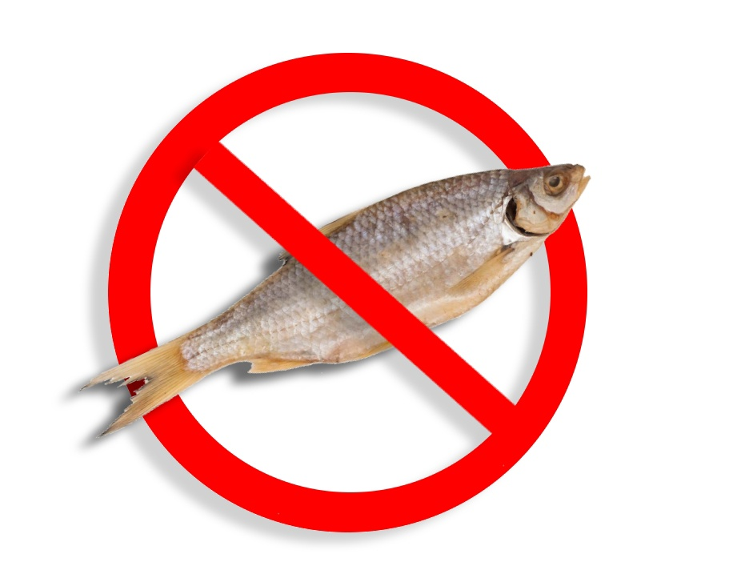

# Инструкция для работы с Markdown

## Выделение текста

Чтобы выделить текст курсивом необходимо обрамить текст (*) или знаком нижнего подчёркивания. Например, *вот так* или _вот так_

Чтобы выделить текст полужирным необходимо обрамить текст (**) или знаком двойного нижнего подчёркивания. Например, **вот так** или __вот так__

Альтернтивные способы выделения жирным или курсивом нужны для того, чтобы мы могли выделять оба эти способа:
_текст может быть курсивом **и одновременно быть полужирным**_

## Списки
Чтобы добавить ненумерованные списки необходимо пункты выделить (*), например вот так:
* Элемент 1
* Элемент 2
* Элемент 3
+ Элемент 4

Чтобы добавить нумерованные списки необходимо пункты пронумеровать и поставить точку после цифры, например вот так:
1. Элемент первый
2. Элемент второй
3. Элемент третий

## Работа с изображениями

Для того чтобы вставить изображение в текст достаточно написать следующее

## Ссылки

## Работа с таблицами

## Цитаты

## Заключение